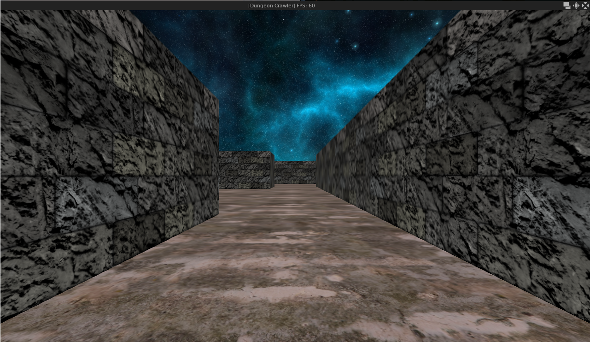
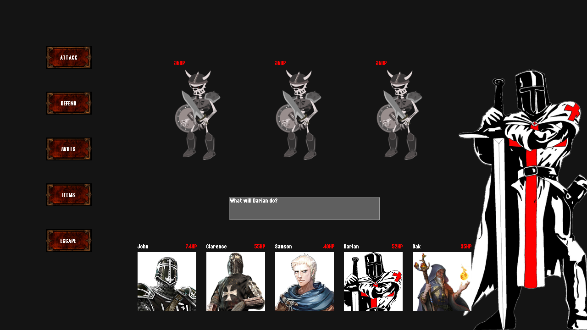

# Dungeon-Crawler
A game I'm working on inspired by traditional first person dungeon crawler rpg titles like Wizardry as well as more modern titles like Etrian Odyssey and Stranger of Sword City. The player can explore a 3D dungeon with a preset party of adventurers. Random battles with monsters will occur as the player navigates the maze. Combat is handled in fairly typical turn based dungeon rpg fashion. 

# Combat Controls
- Press the right mouse button to undo/cancel.
- Press the left mouse button to navigate the menus.

# Dungeon Controls
- Press the 'up' and 'down' arrow keys to move 1 space forward or backward.
- Press the 'left' and 'right' arrow keys to turn left or right.
- Press 'escape' to close the game.
- Press 'b' to force start a battle.

# Windows Installation
1. Download the folder for your release from https://mega.nz/folder/l5dXAKZK#1M4c1KQ50qnpSEtqR0HNkQ 
2. Open the downloaded folder and run game.exe

# Linux Installation
1. Download the newest version at https://mega.nz/folder/l5dXAKZK#1M4c1KQ50qnpSEtqR0HNkQ
2. Unzip the downloaded file
3. cd game-0.2-linux
4. chmod +x game
5. ./game

# Screenshots

# Building from Source

# Planned Updates
- Defend action in combat.
- Better game assets (right now its all placeholders).
- Inventory menu with usable items and character equipment.
- Skills that hit multiple targets.
- Healing skills.
- More monster variety.
- Attack animations and sound effects.
- More floors in the dungeon.
- A town where the player can buy items and rest/save.
- Party customization with classes and skill trees.
- Keyboard controls in combat.
